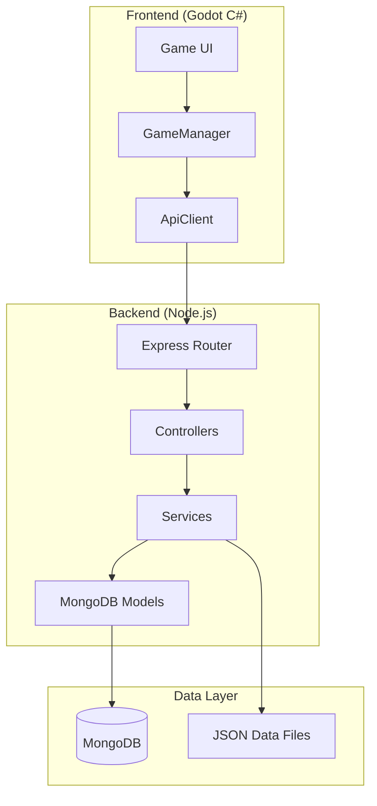
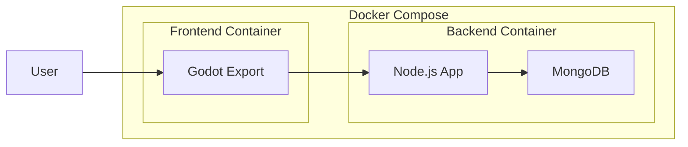

# Architecture Documentation

## System Overview

The Recruiting Bias Detection system is a full-stack application consisting of a Node.js/Express backend API and a Godot/C# frontend game client. The system presents users with candidate profiles and tracks their selection patterns to identify potential hiring biases.

## Technology Stack and Rationale

### Backend: Node.js + Express

**Why Node.js/Express was chosen:**
- **Rapid Development**: JavaScript for both frontend and backend reduces context switching
- **Rich Ecosystem**: Extensive npm packages for API development (Swagger, Mongoose, CORS)
- **JSON-native**: Natural fit for web APIs and database interactions
- **Asynchronous Processing**: Efficient handling of concurrent user sessions
- **Documentation**: Built-in Swagger support for API documentation

**Alternative Considered**: Python/FastAPI
- Rejected due to: More complex deployment, additional dependency management
- Chosen Node.js for: Simpler deployment, unified JavaScript stack

### Database: MongoDB

**Why MongoDB was selected:**
- **Schema Flexibility**: Candidate profiles have varying attributes and skills
- **Document Structure**: Natural fit for complex candidate data (education, experience arrays)
- **Performance**: Fast reads for candidate retrieval during game sessions
- **Scalability**: Horizontal scaling capability for multiple concurrent users
- **Development Speed**: No rigid schema migrations needed

**Alternative Considered**: PostgreSQL
- Rejected due to: Complex schema design for varied candidate attributes
- Chosen MongoDB for: Flexibility in candidate data structure

### Frontend: Godot Engine + C#

**Why Godot was chosen:**
- **Cross-platform Deployment**: Windows, macOS, Linux, and potential mobile support
- **Rich UI Capabilities**: Advanced layout system for resume presentation
- **Performance**: Lightweight engine suitable for interactive applications
- **C# Integration**: Strong typing and modern language features
- **Visual Editor**: Easy UI design and prototyping
- **No Browser Limitations**: Desktop application不受浏览器限制

**Alternative Considered**: React/Vue.js Web Application
- Rejected due to: Browser limitations, complex state management for game logic
- Chosen Godot for: Better game-state management, richer user experience

## System Architecture



## Data Flow Architecture

### 1. Game Initialization
1. **Frontend**: GameManager initializes game session
2. **API Call**: POST `/api/sessions` creates new player session
3. **Backend**: Generates session ID, stores in MongoDB
4. **Response**: Returns session configuration and first round data

### 2. Candidate Selection Process
1. **Backend**: Randomly selects candidates from MongoDB
2. **Filtering**: Applies demographic diversity requirements
3. **Response**: Returns balanced candidate pool
4. **Frontend**: Displays candidate resumes in game UI

### 3. Choice Recording
1. **Frontend**: User selects candidate
2. **API Call**: POST `/api/choices` records selection
3. **Backend**: Stores choice with timestamp and candidate metadata
4. **Analysis**: Real-time bias calculation (future enhancement)

### 4. Game Completion
1. **Frontend**: Final round completed
2. **API Call**: PUT `/api/sessions/:id/complete`
3. **Backend**: Calculates final bias metrics
4. **Results**: Returns analysis and insights

## Database Schema Design

### PlayerSession Collection
```javascript
{
  _id: ObjectId,
  playerName: String,
  startTime: Date,
  endTime: Date,
  totalRounds: Number,
  completedRounds: Number,
  isActive: Boolean,
  biasMetrics: {
    demographic: Object,
    experience: Object,
    education: Object
  }
}
```

### Candidate Collection
```javascript
{
  _id: ObjectId,
  firstName: String,
  lastName: String,
  email: String,
  demographics: {
    age: Number,
    gender: String,
    ethnicity: String
  },
  experience: [{
    company: String,
    position: String,
    duration: Number,
    description: String
  }],
  education: [{
    institution: String,
    degree: String,
    field: String,
    year: Number
  }],
  skills: [String],
  generatedAt: Date
}
```

### PlayerChoices Collection
```javascript
{
  _id: ObjectId,
  sessionId: ObjectId,
  roundNumber: Number,
  selectedCandidate: ObjectId,
  rejectedCandidates: [ObjectId],
  choiceTimestamp: Date,
  timeToDecide: Number,
  decisionFactors: [String] // Future enhancement
}
```

## API Architecture

### RESTful Design Principles
- **Resource-based URLs**: `/api/sessions`, `/api/candidates`, `/api/choices`
- **HTTP Verb Usage**: GET (retrieve), POST (create), PUT (update), DELETE (remove)
- **Status Codes**: Proper HTTP status codes (200, 201, 400, 404, 500)
- **JSON Responses**: Consistent response format with success/error indicators

### Authentication and Security
- **No Authentication**: Currently open for research purposes
- **Input Validation**: All user inputs validated using express-validator
- **CORS Configuration**: Cross-origin requests properly configured
- **Error Handling**: Centralized error handling middleware

## Frontend Architecture

### Component Structure
```
Scripts/
├── Core/
│   ├── GameManager.cs      # Main game logic and state management
│   ├── RoundManager.cs     # Round progression and candidate selection
│   └── UIManager.cs        # UI event handling and updates
├── Services/
│   ├── ApiClient.cs        # HTTP client for API communication
│   ├── CandidateApiService.cs  # Candidate-specific API operations
│   └── GameLogApiService.cs    # Session and choice logging
└── Components/
    ├── Main.cs             # Main menu and game setup
    └── Resume.cs           # Individual resume display
```

### State Management
- **GameManager**: Centralized state for game session, current round, player progress
- **RoundManager**: Manages candidate pool, selection logic, round progression
- **UIManager**: Handles user interactions, displays appropriate UI elements
- **Event-driven**: Uses Godot's signal system for component communication

## Deployment Architecture

### Containerization Strategy


### Production Considerations
- **Backend**: Docker containerized Node.js with MongoDB
- **Frontend**: Exported Godot executable for target platforms
- **Database**: MongoDB with proper indexing and connection pooling
- **Load Balancing**: NGINX for API load balancing (future enhancement)

## Integration Patterns

### API Client Pattern
- **Service Layer**: Dedicated services for different API endpoints
- **Error Handling**: Consistent error handling across all API calls
- **Response Parsing**: Automatic JSON parsing and validation
- **Retry Logic**: Built-in retry for network failures

### Data Synchronization
- **Real-time Updates**: Immediate feedback for user choices
- **Offline Support**: Local caching for network interruptions (future)
- **Conflict Resolution**: Server-side validation prevents conflicts

## Performance Considerations

### Backend Optimizations
- **Database Indexing**: Optimized queries on candidate demographics and skills
- **Connection Pooling**: MongoDB connection pooling for concurrent users
- **Caching**: In-memory caching for frequently accessed candidates
- **Pagination**: Large datasets paginated to prevent memory issues

### Frontend Optimizations
- **Lazy Loading**: Candidates loaded on-demand per round
- **UI Responsiveness**: Asynchronous API calls prevent UI freezing
- **Memory Management**: Proper cleanup of unused game objects
- **Asset Optimization**: Compressed resume data and optimized UI elements

## Security Architecture

### Input Validation
- **Server-side Validation**: All inputs validated before processing
- **Data Sanitization**: Prevention of injection attacks
- **Schema Validation**: MongoDB schema validation for data integrity

### Network Security
- **HTTPS**: Encrypted communication in production
- **CORS**: Properly configured cross-origin policies
- **Rate Limiting**: Prevention of API abuse (future enhancement)

## Scalability Considerations

### Horizontal Scaling
- **Stateless API**: Backend designed for horizontal scaling
- **Load Balancer**: Multiple API instances behind load balancer
- **Database Sharding**: MongoDB sharding for large-scale deployment

### Vertical Scaling
- **Resource Monitoring**: Memory and CPU usage optimization
- **Database Optimization**: Query optimization and indexing strategies

## Future Architecture Enhancements

### Real-time Analytics
- **WebSocket Integration**: Real-time bias detection and feedback
- **Streaming Data**: Live analytics dashboard for researchers

### Machine Learning Integration
- **Bias Detection**: ML models for pattern recognition
- **Predictive Analytics**: Prediction of bias trends

### Multi-tenant Architecture
- **Researcher Accounts**: Multiple researchers with isolated data
- **Study Management**: Configurable study parameters and templates